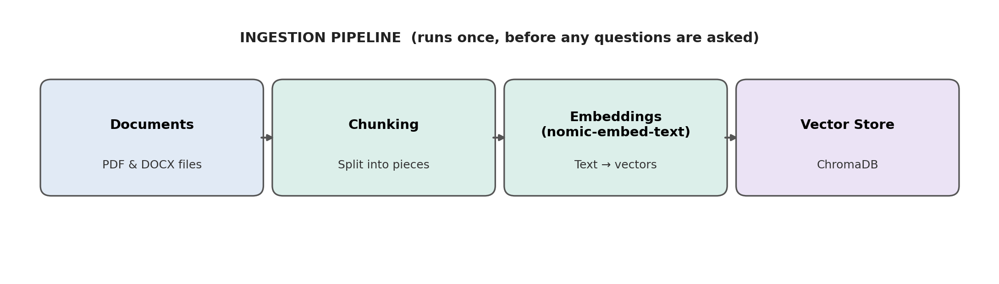
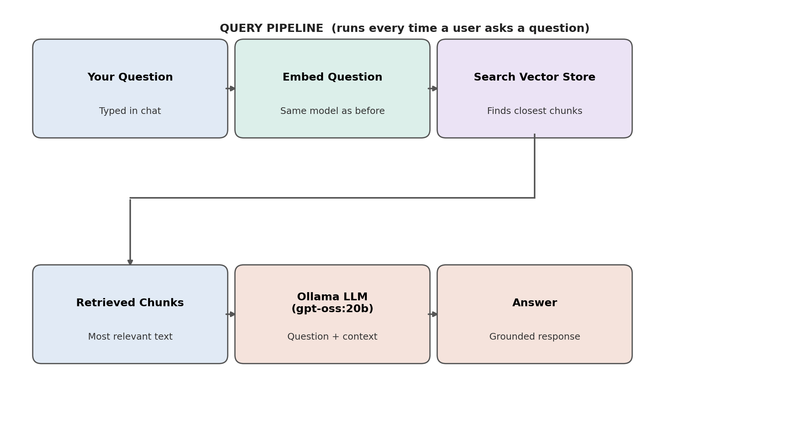

# Local RAG with Ollama - PDF Q&A

A Retrieval-Augmented Generation (RAG) pipeline that runs **entirely on your own machine** — no API keys, no cloud calls, no per-query cost. Ask questions about any PDF or Word document, and a local LLM answers using only the retrieved, relevant content from that document.

Built from scratch (no LangChain / LlamaIndex) to actually understand every moving part: chunking, embeddings, vector search, and grounded generation.

---

## How it works

**Ingestion — runs once, before any questions are asked**



**Query — runs every time a question is asked**



---

## Tech stack

| Layer | Tool | Why |
|---|---|---|
| Local model runtime | [Ollama](https://ollama.com) `v0.31.2` | Runs LLMs and embedding models locally, no API key needed |
| Chat / generation model | `gpt-oss:20b` | Reads retrieved context + question, writes the grounded answer |
| Embedding model | `nomic-embed-text` | Purpose-built for text similarity, ~274MB, fast on CPU |
| PDF parsing | `pypdf` | Extracts readable text from PDF files |
| DOCX parsing | `python-docx` | Extracts readable text from Word files |
| Vector store | `chromadb` | Persisted, local similarity search — no external server |
| Dev environment | Jupyter Notebook | Step-by-step, inspectable pipeline development |

---

## Project structure

```
rag-ollama-project/
├── README.md
├── requirements.txt
├── .gitignore
├── rag_project1.ipynb        # the full worked pipeline
├── diagrams/
│   ├── ingestion_pipeline.png
│   └── query_pipeline.png
└── data/                 # put your own PDF/DOCX here (not tracked in git)
```

---

## Setup

```bash
# 1. Clone and enter the repo
git clone <your-repo-url>
cd rag-ollama-project

# 2. Create and activate a virtual environment
python -m venv venv
# Windows:
venv\Scripts\activate
# macOS/Linux:
source venv/bin/activate

# 3. Install dependencies
pip install -r requirements.txt

# 4. Pull the required Ollama models
ollama pull nomic-embed-text
ollama pull gpt-oss:20b   # or any chat model you already have

# 5. Add a PDF/DOCX to data/, then open the notebook
jupyter notebook
```

---

## Pipeline overview

1. **Load** — extract raw text from the PDF/DOCX (`pypdf` / `python-docx`)
2. **Chunk** — split text into ~800-character pieces with 150-character overlap, so no fact gets cut off mid-sentence
3. **Embed** — convert each chunk into a 768-dimension vector (`nomic-embed-text`)
4. **Store** — persist all vectors + text + page metadata in ChromaDB
5. **Retrieve** — embed the user's question with the *same* model, find the closest chunks via cosine similarity
6. **Generate** — pass only the retrieved chunks + question to the LLM, with an explicit instruction not to guess beyond the given context

---

## Real debugging cases (the actually useful part)

**1. Fragmented PDF text broke retrieval.**
A stat styled as "5th" (with a superscript "th") got extracted as `"5\nth"` across two lines. This weakened that chunk's embedding enough that it dropped out of the top search results. Fixed with a regex cleanup pass before chunking.

**2. `NameError: all_chunks is not defined` after restarting the kernel.**
Jupyter keeps code visible on screen, but variables only exist for cells actually executed in the current kernel session. Restarting the kernel wipes memory even though the code still "looks" run. Fix: `Kernel → Restart & Run All`.

**3. The LLM correctly refused to answer an ambiguous stat** ("5th in India, 4th" — 4th in *what*?) rather than guessing — proof the anti-hallucination prompt instruction was working, not a bug.

---

## What this project actually teaches

- **Embedding** — converting text into numbers that represent meaning
- **Vector store** — where those numbers are saved and searched
- **Chunking (with overlap)** — splitting documents without losing context at the edges
- **Cosine similarity** — the math behind "how close are these two meanings"
- **Retrieval** — the search step that finds relevant chunks
- **Grounded generation** — forcing the LLM to answer from retrieved text, not its training memory
- **Hallucination mitigation** — via explicit prompt instructions
- **Debugging RAG** — inspecting retrieval and the LLM's exact context separately before blaming the model

---

## Notes

- The sample data used during development was a sample pdf file — **not included in this repo**. Drop your own PDF/DOCX into `data/` to try it.
- No LangChain/LlamaIndex was used intentionally — the goal was understanding the mechanics before reaching for abstractions.

## License

MIT — see `LICENSE`.
